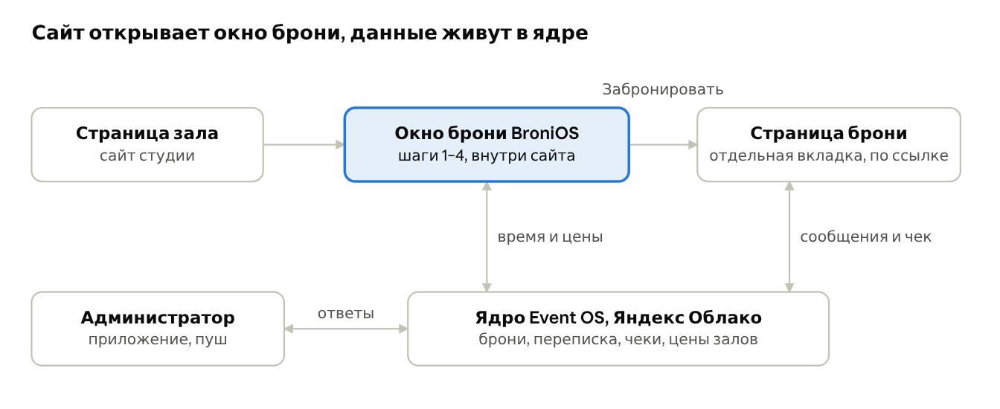

# BroniOS: вход клиента с сайта в бронь

6 октября 2026 · Алексей Новопашин

Скачиваемая копия онлайн-документа: https://claude.ai/code/artifact/7b76b2bb-0a2f-4dfc-ad2b-fa66a77b36be

## Что проектируем

**Вход** — это окно брони BroniOS. Сайт студии открывает его у себя вместо окна AppEvent, и через него клиент попадает в бронь. На выходе клиент получает свою **страницу брони по ссылке**: время, деньги, переписка, чек.

Окно открывается из двух мест сайта «Томсона»: внизу страницы каждого зала (блок «Онлайн-бронь») и на странице «Расписание». Сайт для этого не переделываем, в его файлах меняется только адрес окна (поле `widget` в `content/zal-*.json` и `raspisanie.json`).

Всё, что здесь не помечено как решение Алексея, — это предложение.

## Путь клиента: четыре шага и страница брони

*Шаги 2 и 3 уточнены принятым макетом 07.10: выбор времени, дополнения и экран «Личная информация» устроены так, как описано в разделе «Принятый дизайн окна брони (07.10)» в конце файла. Где описания расходятся, верен тот раздел.*

Клиент идёт по шагам и всегда видит цену. Пример ниже на реальных ценах сайта: Эдисон, 1–9 человек, 1 600 ₽ в час.

1. **Зал.** Со страницы зала он уже выбран, шаг пропускается. На «Расписании» три кнопки: Эдисон, Сфера, Вегас.
2. **Дата и время.** Свободное время белое, занятое серое, прошедшее бледное и не нажимается. Одно нажатие на 14:00 сразу выбирает минимум зала: «14:00–15:00 · 1 600 ₽». Дальше кнопки «+30 мин» и «−30 мин»: «14:00–15:30 · 2 400 ₽».
3. **Кто и зачем.** Сколько человек (от этого зависит цена: 1–9, 10–15, 16–30), цель («аренда со своим фотографом» или «фотосессия с нашим»), имя, телефон, почта и соцсеть для связи. Какие из этих полей показывать и какие делать обязательными, студия настраивает в админке. Две отдельные галочки: «С правилами студии согласен» (только правила студии) и согласие на обработку персональных данных со ссылкой на политику студии (Алексей, 07.10: сейчас в форме юр. информации нет; формулировку и нужную форму согласия подтверждает юрист). Постоянного клиента форма узнаёт: если браузер уже знаком ядру (клиент бронировал здесь раньше или открыл ссылку на прежнюю бронь), имя, почта и соцсеть подставлены, остаётся проверить. По одному номеру без кода чужие данные не показываются (код платный, его не берём). Ниже блок «Дополнительные услуги и оборудование»: галочки из каталога студии (гаффер, фотограф, уборка, съёмка с животными, любые свои услуги и прокат).
4. **Итог.** «Эдисон, 12 октября, 14:00–15:30, 4 человека, 2 400 ₽; уборка 500 ₽; всего 2 900 ₽, предоплата 50% — 1 450 ₽» (строка за каждую выбранную услугу есть, только если клиент её отметил; строка про предоплату есть, только если студия её берёт) и кнопка «Забронировать». Если есть скидка, в итоге видно и цену до скидки, и после. Поле «Промокод» нужно только тем, у кого он есть (правило скидок — в таблице решений ниже). Если чего-то не хватает, кнопка не сереет молча, а подсвечивает нужное поле.
5. **Страница брони.** После нажатия клиент попадает на свою страницу со случайным длинным адресом. *(Подробно, по макету 08.10, — раздел «Страница брони (макет 08.10)» в конце файла; где описания расходятся, верен тот раздел.)* На ней: статус, цена «внесено / осталось», сколько и как внести предоплату (если студия её берёт), кнопка «Приложить чек», окно переписки с администратором, кнопка «Сообщать мне», правила и «Как нас найти».

**Статусы брони (решение Алексея 06.10):** заявка → подтверждено → прошедшая бронь, а также «отменили» и «не пришли». Последние два нужны «особенно для статистики спроса и занятого времени». Бронь закрывает время в календаре с момента заявки и держит его, пока администратор не поменяет статус; «отменили» освобождает время, но запись остаётся в истории (мой вывод). Другие клиенты видят занятое время занятым, очереди нет. Предоплата и чек — события внутри брони, а не отдельные статусы (мой вывод).

Пока клиент заполняет шаг 3, выбранное время держится за ним 10 минут, чтобы его не занял другой (моё предложение, число можно менять). Автоотмена неоплаченной брони есть, но выключена, пока администратор её не включит (это уже ваше решение).

## Как клиент возвращается к своей брони

Пароля и учётной записи у клиента нет: ключом служит сама ссылка, а телефон нужен, только если ссылка потерялась. Так делают кинотеатры и билетные сайты, это ваше решение от 05.10.

| Ситуация | Что делает клиент | Что получает |
| --- | --- | --- |
| Тот же телефон и браузер | Открывает сайт студии | В окне брони сверху плашка «Ваша бронь: Эдисон, 12 октября, 14:00». Браузер помнит её сам |
| Сохранил ссылку | Открывает её на любом устройстве | Сразу свою страницу брони. Угадать чужую ссылку нельзя, в ней длинный случайный ключ, а не номер |
| Новый браузер, ссылки нет | Нажимает «У меня уже есть бронь», вводит телефон | Одноразовый код (только бесплатным каналом, без SMS) → список своих броней в этой студии. По одному номеру без кода ничего не показывается |
| Совсем потерялся | Пишет или звонит в студию | Администратор одной кнопкой присылает новую ссылку, старая перестаёт работать |

Телефон клиента превращается в его ID в ядре (`id<номер>`), как в Light Plan. Один и тот же человек в разных студиях — один ID, но каждая студия видит только свои брони. Платную SMS для кода не подключаем (решение Алексея 06.10). Код по номеру появится, только если найдётся бесплатный канал, например бот в Telegram или Max. До тех пор потерянную ссылку присылает администратор.

## Что сайт вставляет у себя

Сайт получает один адрес на каждый зал и один на все залы и ставит их вместо адреса AppEvent. Пример вида (сам адрес ещё не выбран):

| Где на сайте | Адрес окна |
| --- | --- |
| Страница «Эдисон» | `…/b/pl1/edison` |
| Страница «Сфера» | `…/b/pl1/sfera` |
| Страница «Вегас» | `…/b/pl1/vegas` |
| Страница «Расписание» | `…/b/pl1` (все залы) |

`pl1` — номер студии «Томсон» в ядре (условно), `edison`/`sfera`/`vegas` — те же имена залов, что уже на сайте. Другая студия на платформе получит такие же адреса со своим номером и сможет вставить их хоть в свой сайт, хоть в описание ВК, хоть прислать ссылкой.

**Два технических решения, которые я принял сам:**

- **Шаги 1–4 идут внутри сайта, а страница брони открывается целиком, на весь экран.** Причина: на iPhone браузер часто не даёт «окну в окне» запоминать что-либо, и клиент потерял бы свою бронь. На целой странице её можно сохранить в закладки и включить «Сообщать мне». Плашка «Ваша бронь» внутри окна на сайте надёжно заработает, когда окно будет жить на поддомене сайта (например, `бронь.томсон.рф`). До тех пор на iPhone она может не показываться (не проверено).
- **Окно само сообщает сайту свою высоту.** Тогда ничего не «уезжает», и при переходе к следующему шагу сайт прокручивается к верху окна. Для этого сайту нужны несколько строк в его скрипте. Это работа соседнего проекта (сайт), здесь только описываем, что окно присылает. Без этих строк окно тоже работает, просто с неподвижной высотой, как сейчас (1 120 точек).

Цены и названия залов окно берёт там же, откуда их берёт сайт, чтобы не было двух прайсов. Сегодня это файл цен сайта (`prices.json`, правится в админке), потом — карточка студии в ядре.

*Схема (картинка лежит рядом с этим файлом): страница зала на сайте → окно брони BroniOS (шаги 1–4, внутри сайта) → «Забронировать» → страница брони (отдельная вкладка, по ссылке). Окно и страница брони обмениваются с ядром Event OS в Яндекс Облаке (время и цены; сообщения и чек), администратор отвечает из приложения с пушем.*

Сайт только показывает окно. Всё, что клиент выбрал и написал, хранится в ядре, и туда же смотрит администратор.

## Чем это лучше окна AppEvent

Каждая строка — боль из вашего разбора AppEvent и то, как её снимает вход BroniOS.

| В AppEvent сейчас | В BroniOS |
| --- | --- |
| Окно не ведёт клиента, всё на одном экране | Четыре шага: зал → время → кто → итог |
| Минимум 1 час набирается двумя кликами по полчаса, красный блок без объяснения | Один клик = минимум зала с ценой, дальше ±30 мин |
| Таблица «уезжает»: меняется высота, страница остаётся прокрученной | Окно сообщает высоту, на каждом шаге — к верху окна |
| Серая кнопка без причины | Кнопка подсвечивает, чего не хватает |
| Обязательное поле «люди» спрятано за ценой | Число людей — первое поле шага 3, цена меняется на глазах |
| Три галочки согласия, две из них — правила самого AppEvent | Две галочки: правила студии и согласие на обработку данных; правил самого AppEvent нет |
| Прошедшее время выглядит как занятое | Прошедшее бледное, занятое серое |
| Переписка через платный Wazzup, чек клиент шлёт в мессенджер, администратор связывает вручную | Переписка и чек прямо на странице брони, сразу привязаны к ней |
| Письма попадают в спам, SMS не читают | Главное — сама ссылка и «Сообщать мне» в браузере, мессенджеры — по выбору клиента |

## Решения Алексея (06.10)

| Вопрос | Ответ Алексея, дословно | Что это значит для окна брони |
| --- | --- | --- |
| Код при брони | «если для этого нужно подключать платную систему подтверждения по смс, то нет, код не нужен» | Бронь без кода. Платную SMS не подключаем |
| Почта и связь | «почта и соцсети нужны, на почту отправляются чеки, это важно, но в админке надо дать возможность настройки» | На шаге 3 поля «почта» и «соцсеть». Студия в админке решает, какие поля показывать и какие обязательны. Чеки уходят клиенту на почту |
| Предоплата | «предоплата настраиваемая, кто-то берет 100%, 50%, 30%, не берет вообще» | Настройка студии: 100%, 50%, 30% или без предоплаты. Клиент видит сумму к предоплате в итоге; без предоплаты этой строки нет |
| Неоплаченное время | «нет, бронь перекрывает время в календаре, пока админ не поменяет статус, у съемки три статуса заявка, подтверждено, прошедшая бронь» | Время занято с момента заявки, очереди нет. Статусы: три основных плюс «отменили» и «не пришли» |
| Постоянные клиенты, услуги и оборудование (07.10) | «форма бронирования должна узнавать постоянных клиентов. в форме должна быть возможность подгрузить список оборудования и услуг… это должна быть подключаемая функция. На сайте есть перечень услуг, пусть они будут подключаться автоматически, без необходимости настраивать на сайте и в Broni раздельно. Гаффер (помощь по свету), Фотограф, Уборка, Съемка с животными (можно создать любую доп услугу)» | Каталог услуг и оборудования живёт в ядре один раз и виден и сайту, и окну брони. Студия заводит любую свою услугу. Выбранные услуги попадают в бронь, цену и чек. Постоянный клиент узнаётся без SMS-кода: данные подставляются, если браузер ему знаком. Цена услуги: решено (Алексей, 07.10) и за час, и фиксированная, способ выбирает студия на каждую услугу. Что услуга не занимает время зала: пока предложение |
| Виджет на нашем и на чужом сайте, цены, оформление (07.10) | «Админка должна учитывать, работает виджет с подключением к нашим сайтам или нет… Если на сайте я поменял цену зала, то и в бронях цены меняются, также и со скидками. Дизайн по цветам и шрифтам должен быть настраиваемым… не только на нашей платформе» | Два режима: подключён к сайту платформы (каталог услуг, цены и скидки общие с сайтом) или сам по себе на чужом сайте (список услуг и цены ведутся в BroniOS). Цвета и шрифты задаёт студия, по умолчанию стиль нативного календаря iOS как в Light Plan. Новая цена: решено (Алексей, 07.10) только для новых броней; любая уже созданная бронь, даже заявка, держит свою цену. Вид календаря и формы делает тред «Макет записи клиента» |
| Местное время и свет (07.10) | «Календарь должен учитывать местное время и показывать условия света. LightPlan умеет считать траекторию солнца, код возьмем оттуда… в админке сайта и админке Broni можно указать на карте положение зала, и модель будет подсказывать прямой свет, закатный, рассеяный» | Слоты показываются в местном времени студии, не телефона гостя. У зала в ядре один раз задаются точка на карте, азимут окон, «окон нет» и часовой пояс, общие для сайта и BroniOS. На слоте подсказка: прямое солнце, закат, рассеянный свет (для зала без окон «студийный свет»); это подсказка, на цену и занятость не влияет. Расчёт солнца берётся из готовой проверенной модели Light Plan (хозяин модуля Light Plan, решено 07.10) (формулы NOAA, есть и в вебе, и в Swift); правило «прямой / закатный / рассеянный» для зала с окнами дописывается поверх неё. Вид календаря делает тред «Макет записи клиента» |
| Часы работы (07.10) | «календарь должен учитывать время работы студии, например мы работаем с 8:00 до 23:00 по предварительной записи, но я могу поставить бронь вручную хоть с 6 утра до 02:00 ночи, у админа нет блока, у клиентов есть» | У студии (и при необходимости у зала) в ядре есть часы работы. Клиент выбирает время только внутри них (у «Томсона» 8:00–23:00, бронь должна заканчиваться не позже закрытия). Администратор может поставить бронь вручную в любое время, в том числе через полночь. Проверку границ делает ядро и только для броней клиента. Вид календаря делает тред «Макет записи клиента» |
| Юридическая часть формы (07.10) | «юр. инфы нет, что мы обрабатываем данные и клиент даёт согласие на обработку данных» | В форме нужны сообщение о том, что студия обрабатывает персональные данные, и отдельная галочка согласия (не отмеченная заранее) со ссылкой на политику студии. Ядро хранит факт согласия: кто, когда, на какую версию текста, в какой студии и форме. Оператор данных, по моему предположению, студия, платформа обработчик; это и формулировки требуют юриста. Юридическое лицо: сейчас самозанятый, к запуску платформы ИП (Алексей, 07.10), юридические вопросы решаются перед выпуском. Текст политики и согласия: типовой шаблон платформы, один раз проверенный юристом, студия подставляет реквизиты (Алексей, 07.10) |
| Роли студии (07.10) | «студией могут управлять хозяин, директор, администратор» | Для окна брони клиента ничего не меняется: клиент видит только свою бронь. Роли студии (хозяин, директор, администратор, модератор) живут в ядре, права директора пока предложение |
| Тип брони и правка суммы (07.10) | «возможность править съёмку: переключать тип, фотосессия, аренда… тарифы на видеосъёмку и фотосъёмку разные»; «изменять конечную прибыль… было 1600, а стало 2800, но время не менялось» | У брони есть тип (фотосессия, аренда, видеосъёмка…), цена зала зависит от типа, если у студии тарифы разные. Клиент выбирает «цель» на шаге 3, это и есть тип. Администратор может поменять тип и итоговую сумму брони, время не трогается; правки сумм записываются (кто, когда, было → стало, причина). Это экраны админки, окно брони клиента не меняется |
| Чистая прибыль в статистике (07.10) | «давай добавим в статистику подсчёт чистой прибыли. строка налоги (сумма или процент), строка аренда помещения, зарплата сотрудникам, расходники, прочее» | Окна брони клиента это не касается. Расходы студии хранятся в ядре, видны только тем, кому разрешено (предложение: хозяин и директор). Чистая прибыль = выручка периода − расходы; налог в процентах считается от выручки |
| Отзывы (07.10) | «на почту клиенту в конце аренды приходит сообщение с предложением оставить отзыв / в админке отдельный пункт обработки отзывов / будет каталог студий и там можно будет обрабатывать отзывы, админ сам решает отображать отзывы или нет, отображать отрицательные отзывы или нет, на рейтинг и выдачу не влияет» | После статуса «прошедшая» клиенту на почту уходит письмо со ссылкой на отзыв (предложение: одна ссылка на бронь). Отзыв — отдельная галочка согласия на публикацию. Студия сама включает показ отзывов и показ отрицательных; рейтинг и порядок в каталоге от отзывов не зависят |
| Закрытие зала (07.10) | «справа от названия студии надо добавить статус зала и возможность закрытия, на уборку, ремонт, смену декораций» | В окне брони время закрытия выглядит как занятое, без причины (предложение). Клиент не может выбрать это время; уже созданную бронь студия переносит или отменяет по решению администратора, клиент получает сообщение |
| Список залов (07.10) | «должна быть возможность добавлять и убирать залы, переименовывать залы» | Клиент видит только действующие залы. Переименование меняет подпись и в старых бронях. Убранный зал уходит в архив и в окне брони пропадает; убрать зал с будущими бронями нельзя, пока их не перенесли или не отменили |
| Данные брони для подготовки (07.10) | «открыл и сразу видишь, какое оборудование надо подготовить, детская съёмка или 30 школьников, фоны надо ставить и какой цвет, нужна помощь по свету или нет» | В окне брони клиент указывает гостей (отдельно детей), может отметить фон и цвет и услугу «помощь по свету» (предложение). Заметка для персонала клиенту не видна |
| Поиск по броням (07.10) | «надо добавить возможность переключаться на другой год; добавить поисковик по броням. Мне надо срочно найти все съёмки с собаками, или всех Елен» | Окна брони клиента это не касается. Для поиска «съёмок с собаками» в окне брони нужен вопрос про животных (услуга «Съёмка с животными», предложение); клиент ищет только свои брони на своей странице |
| Скидки | «скидки либо по промокоду либо по выставленным параметрам администратора, скидки не суммируются… применяется промокод если его предъявят» | Два вида: промокод и автоматические по правилам админа (например, утро, промокод не нужен). Не складываются. Предъявлен промокод — действует он, даже если автоматическая скидка больше; нет промокода — автоматическая. Поле «Промокод» в окне брони необязательное. Если на час подходят две автоматические скидки, а промокода нет, действует выгодная клиенту (Алексей, 07.10) |

**Что уходит клиенту на почту (Алексей 06.10):** «самозанятый в мой налог, если настроена онлайн касса то эквайринг»; «также на почту высылаются правила студии». Значит, на почту уходят правила студии и чек об оплате. Чек даёт то, через что студия принимает деньги: у самозанятого — «Мой налог», при онлайн-кассе — эквайринг. Способ выбирает студия в настройках. Как чек из «Моего налога» попадает в письмо (администратор прикладывает его или система берёт сама), ещё не проработано. Статусы «отменили» и «не пришли» Алексей добавил 06.10 в обсуждении требований к ядру.

У самозанятых чеки часто высылают вручную (Алексей, 06.10), поэтому в брони нужно поле «чек отправлен / не отправлен» с ручной отметкой; решение по системе чеков пока не принято.

## Принятый дизайн окна брони (07.10)

Алексей принял дизайн 07.10 («дизайн принят»). Исходник макета лежит рядом: `booking_widget_mockup_accepted_2026-10-07.html` (открывается в любом браузере, данные тестовые). Онлайн-копия: https://claude.ai/artifact/38iCgux9dBpGiUMRkFoD64 (версия 14).

**Шаги.** Время → Дополнения → Личная информация → Итог → страница брони. Со страницы зала зал уже выбран; на «Расписании» его выбирают над календарём.

**Календарь, как в iOS и Light Plan (Алексей: «пусть будет преемственность»).**
- Месяц: под числом словами, сколько часов свободно («5 ч», «занято»), а не точки. Прошедшие дни бледные и не нажимаются.
- День: сверху неделя (листается свайпом или стрелками), ниже лента часов. Нажатие на верх строки часа = ровно (14:00), на низ = с половиной (14:30). Одно нажатие сразу ставит минимум (1 час) с ценой. Длительность меняется перетаскиванием кружков на рамке (начало справа сверху, конец слева снизу), шаг 30 минут. Вместо кнопок «±30 мин» из раздела выше.
- Если до занятого меньше часа, рамка сдвигается на полчаса назад, если это помогает; иначе подсказка, почему нельзя.
- Время местное (часовой пояс студии), линия «сейчас».
- Прошедшие часы сегодня просто заштрихованы, чужих броней в них не видно; бронь, которая уже идёт, подписана «Занято до 20:00».
- Часы работы для онлайн-записи задаёт студия (у «Томсона» 8:00–23:00). Брони админа вне этих часов клиент видит занятыми, только в пределах часов работы; край за границей отмечен пунктиром. Текст в карточке дня: «Нужно раньше или позже — напишите администратору».

**Свет (модель солнца Light Plan).** Карточка дня: восход, закат, золотой час и когда прямое солнце в окна зала. Рядом с часами цветная полоса света: прямое солнце, закатное солнце, рассеянный, сумерки, темно; без окон — студийный свет. В рамке выбранного времени подпись «закатное солнце в окна → сумерки». Нужно направление окон зала (студия ставит на карте): Эдисон и Сфера на юго-запад, Вегас на северо-восток (Алексей 07.10).

**Подобрать (фильтры над месяцем).** «Солнце в окнах» и «Дни недели» (например, все свободные пятницы); оба вместе. Ниже список подходящих дней со свободными отрезками, нажатие ведёт в день с уже выбранным временем.

**Много залов.** До 3 залов — переключатель в ряд. Больше 3 — бесконечная карусель (…6, 7, 1, 2…) с доводкой по одному залу; зал, остановившийся в центре, выбирается сам и подсвечивается (по мотивам барабана дат Light Plan, но не копия). Рядом кнопка «Все N ▾» со списком.

**Компьютер.** Три колонки, как Календарь на Mac: слева залы списком, фильтры и месяц; в центре выбранный день лентой часов; справа шаги брони. При наведении мыши на ленту пунктир показывает час, который займёт клик. Страница брони занимает центр и правую часть.

**Дополнения.** Услуги (Гаффер, Фотограф, Съёмка с животными, Уборка и любые свои) и оборудование списком с переключателями и ценой; цены и список — с сайта студии, если сайт на нашей платформе, иначе из админки BroniOS.

**Личная информация** (название от Алексея вместо «Кто придёт»).
- Сколько человек (меняет цену), имя, телефон, почта.
- «Где удобнее переписываться», можно несколько: кнопки-логотипы Telegram, WhatsApp, ВКонтакте, Max и «Другое» со свободным полем. Telegram, WhatsApp и Max берут телефон клиента; ВКонтакте просит ссылку или ник.
- Две отдельные галочки, не отмеченные заранее: «С правилами студии согласен» и «Согласен на обработку персональных данных» (152-ФЗ). Под второй раскрывается «Как студия обращается с данными»: кто, зачем, где хранятся, сколько, как отозвать. Текст политики студия загружает в админке; срок хранения в макете — пример, решит юрист.

**Постоянный клиент.** Окно узнаёт его только по памяти браузера на том же устройстве (без кода по номеру). Над календарём «Здравствуйте, Анна!» и «Не вы?». «Не вы?» открывает окно «Проверьте личные данные» с наполовину скрытыми телефоном и почтой и тремя кнопками: «Да, это я», «Изменить данные», «Это не я, ввести свои». Постоянный клиент не заполняет контакты и не ставит галочку данных заново («согласие дано при прошлой брони»).

**Итог.** Строки зала, каждой выбранной услуги, скидки (промокод или автоматическая, не складываются, промокод побеждает), предоплата по настройке студии; кнопка «Забронировать · сумма».

**Оформление под сайт.** Цвета, шрифт и скругление окна задаёт студия (готовые наборы и свои), чтобы окно встраивалось в любой сайт.

## Страница брони (макет 08.10)

Макет: https://claude.ai/artifact/5Bmo4ocjosKF1Qba86wwWy (копия `client_booking_page_mockup_2026-10-07.html` рядом с этим файлом). Он связан с макетом админки: что клиент нажал у себя, приходит администратору во «Входящие» (Алексей, 08.10: «отлично, связывай»). Что из этого нужно от ядра, описано в блоках 23–25 файла `BroniOS_core_requirements.md`. Всё ниже, кроме отмеченного «Решено», это предложения: в макете работает, отдельного слова Алексея на каждое правило нет.

**Сверху** статус, крупная дата, зал и время. До съёмки «начало через …», во время съёмки кольцо «до выхода» (выход = конец − (60 − hourMin), как в Light Plan: при hourMin 55 бронь 14:00–16:00 выходит в 15:55; блок 25 требований).

**Вид как у банковского приложения (Алексей 09.10).** «Шапка главного экрана должна быть выделена цветом», «клиенту важно видеть дату, время, зал студии… считать за секунду», «статус предоплаты также требует выделения, и добавления зелёной галочки», «сразу под важнейшей информацией… кнопки: Связаться, найти вход» (люди в стрессе, за рулём и на бегу не догадываются прокрутить экран). Поэтому весь главный экран без прокрутки:
- цветная шапка в фирменном цвете студии: статус, день и дата, крупно время, крупно зал;
- под ними две большие кнопки «Связаться» и «Найти вход» (во время съёмки «Позвать админа» и «Связаться»);
- полоса предоплаты: зелёная галочка «Предоплата … внесена», жёлтая «не внесена» с кнопкой «Оплатить» или «Чек», серая «пока не нужна»;
- ниже на белой карточке круглые кнопки момента брони (перенести, в календарь, карточка съёмки, свет; во время съёмки продлить; после «Забронировать снова» и отзыв).
«Связаться» открывает лист: позвонить, мессенджеры студии и переписка по этой брони. «Найти вход» открывает лист: фото входа, адрес, шаги «как пройти», «Открыть в картах». Фото и шаги студия пишет один раз в настройках. Цвета Сбера и чужие логотипы не берём: только сама схема экрана. Цвет шапки студия выбирает в настройках вида страницы (Алексей 09.10): «как акцент» (цвет кнопок студии), готовый цвет или свой; цвет текста на шапке, белый или тёмный, страница подбирает сама по контрасту.

**Логотип студии (Алексей 09.10).** Студия загружает логотип в настройках («Ещё → Студия → Логотип»). Если он есть, в шапке страницы он стоит вместо названия студии, на светлой плашке, чтобы читаться на любом цвете шапки; подпись «фотостудия · ваша бронь» остаётся. Без логотипа показывается название текстом. То же на странице для плательщика по ссылке.

**Удобства (Алексей 09.10 и 10.10).** В блоке «Ещё» одна строка «Удобства» (например, «Лифт, Туалет, Душ и ещё 12»). Нажатие открывает лист из двух разделов: «Ресепшен и холл» и «В зале …», у каждого свой список с зелёными галочками. «Лифт» и «Без лифта, только лестница» показаны значком лифта и зачёркнутого лифта, второй окрашен предупреждающим цветом и с подсказкой написать администратору заранее. Главный экран это не нагружает.

**Ручные шаблоны студии (Алексей 09.10).** Что «Томсон» писал клиенту руками, теперь на странице, но без перегруза: этаж и офис под залом; реквизиты (несколько карт, телефон, держатель), правило чека и согласие с правилами в окне оплаты; срок переноса и отмены (48 ч у «Томсона») только в окнах «Перенести» и «Отменить»; цены по числу людей за строкой суммы; приложил чек — бронь подтверждается сама; памятка (обувь, циклорама, подготовка) свёрнутой строкой и напоминанием накануне. Подробно: требования, блок 24.

**Кнопки по моменту брони.**
- До съёмки: «Перенести» (это просьба, бронь двигает только администратор) и «В календарь».
- **Перенос делает администратор (Алексей 08.10, хаб A-007).** Клиент сам бронь не двигает и ничего не подтверждает: он просит перенос кнопкой «Перенести», по телефону или в мессенджере, а администратор переносит сразу, без второго подтверждения. Клиенту приходит сообщение в чат брони «Мы перенесли вашу бронь на …». В брони остаётся запись, кто и когда сдвинул. Кнопок «Принять / Отклонить» на странице нет.
- Во время съёмки: «Позвать администратора» и «Продлить на 30 минут».
- После съёмки: «Забронировать снова» (то же окно брони с тем же залом и той же карточкой) и отзыв.

**Оплата**, три режима, выбирает студия:
- вручную: клиент переводит сам и нажимает «Приложить чек», администратор отмечает «Деньги пришли». ~~Реквизиты на странице не показываются~~ **Изменено 09.10 (Алексей):** реквизиты показываются в окне «Внести предоплату», номер карты, номер телефона и сумма копируются нажатием;
- онлайн: кнопка «Оплатить», чек присылает касса;
- без предоплаты.

Отдельно строка «Чек от студии на почту».

**Полоса предоплаты и ссылка на оплату (Алексей 09.10).** В шапке полоса с двумя состояниями: «Внести предоплату» (жёлтая) и «Предоплата внесена» (зелёная галочка). Нажатие на «Внести» открывает окно со способами, которые заранее настроил админ: «Оплатить картой или СБП» (уводит на эквайринг) и/или перевод по реквизитам с копированием. Наверху окна кнопка «Отправить ссылку тому, кто платит»: бронирует часто фотограф, а платит его клиент. Плательщик по ссылке видит только студию, зал, дату, время и сумму, ничего не заполняет, только платит или прикладывает чек; бронь отмечается «оплатил другой человек по ссылке».

**Карточка съёмки** та же, что у администратора, только для просмотра. Кнопка «Заполнить» открывает тип съёмки, гостей, фоны, «что подготовить к приходу», платные доп. услуги и прокат, помощь со светом и примечание. Итог пересчитывается сразу, администратор получает «Клиент дополнил карточку». Заполнять можно до конца съёмки.

**Отмена.** До начала, причина по желанию. Время освобождается сразу. Раньше чем за 24 часа (срок задаёт студия) предоплата возвращается, позже остаётся студии.

**Ещё на странице:**
- свет в зале по модели солнца Light Plan;
- переписка с администратором;
- «Сообщать мне»: напоминание за час, выход за 10 и за 5 минут;
- правила студии, карта, «скопировать ссылку», строка про Light Plan для фотографов.

**Отзыв** после съёмки: звёзды, текст и отдельная галочка «можно показать на сайте».

